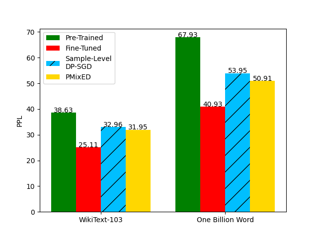

# PMixED: Private Mixing of Ensemble Distributions 
This is the software implementation of PMixED from the paper [Differentially Private Next-Token Prediction of Large Language Models](https://arxiv.org/pdf/2403.15638.pdf). PMixED is a differentially private next token prediction protocol that takes advantage of two facts: (1) randomness comes for free if sampling the probability output distribution from a language model; (2) employing a public language model can bound the privacy lekage of private data. PMixED partitions a private downstream dataset $D$ into pairwise disjoint subsets $D_i$, each of which is fine-tuned with an LLM $p_i$. Then for each query $\mathbf{x}_t$ recieved by PMixED, it subsamples a random subset of the ensemble, then produces the output probability distributions of each private model $p_i(\mathbf{x}_t)$ and the output probability distribution of a public model $p_0(\mathbf{x}_t)$. Each $p_i(\mathbf{x}_t)$ is projected along a Renyi Divergence ball centered at $p_0(\mathbf{x}_t)$ to produce $\overline{p}_i(\mathbf{x}_t)$. Lastly, each $\overline{p}_i(\mathbf{x}_t)$ is averaged then sampled. The figure below succintly illustrates this. 


In the paper, we showed that PMixED satisfies DP and achieves group-level privacy. To reduce the storage cost of our implementation, we used LoRA adapter weights for our ensemble. Our results show that PMixED improves the prediction perplexity of LLMs over DP-SGD.  



## Evironment Setup
We used Python3.10 in our implementation. Run the following lines to set up the evironment: 

```bash
sudo apt install python3.10
sudo apt install python3.10-venv
python3.10 -m ensurepip --upgrade
python3.10 -m venv venv
source venv/bin/activate
python3.10 -m pip install -r requirements.txt
```

## Ensemble/DP model Setup
Fine-tuned models used in the paper can be accessed [here](https://drive.google.com/file/d/1v4Yp1AdofrXLqmb-ip4iXcYFHk9x_yt6/view?usp=drive_link). Be sure to untar the file in the root directory of this directory. However, if you decide to train the ensemble from scratch, then use the following command to reproduce our models:

```bash
python -m torch.distributed.run --nproc_per_node=num_gpus fine_tune_ensemble.py \
    --model_name=GPT2 \
    --dataset=wikitext \
    --subset=wikitext-103-raw-v1 \
    --num_ensemble=100 \
    --epochs=15 \
    --lora_r=4 \
    --lora_alpha=32 \
    --lora_dropout=0.1 \
    --block_size=512 \
    --learning_rate=2e-4 \
    --weight_decay=0.01 \
    --batch_size=8 \
    --dp_batch_size=256 \
    --training_type=samp-agg \
    --max_grad_norm=1. \
    --epsilon=8. \
    --delta=1e-5 \
    --num_gpus=num_gpus \
    --num_proc=64
```

To reproduce the DP-SGD model, set ```--training_type=dpsgd```. To train on the One Billion Word dataset, set ```--dataset=lm1b --subset=None```.

## Private Prediction Experiments
To reproduce our comparison result, run the following command
```bash
python prediction_experiments.py \
    --num_ensemble=80 \
    --model_name=GPT2 \
    --dataset=wikitext \
    --subset=wikitext-103-raw-v1 \
    --device=cpu \
    --seq_length=512 \
    --epsilon=8.0 \
    --alpha=3 \
    --delta=1e-5 \
    --p=0.03 \
    --iters=32
```

And for the Ablation Study on the hyperparameters: ```python hyperparameter_experiments.py```.

## Citation
If you use this repository, please consider citing our work: 
```stex
@article{flemings2024differentially,
  title={Differentially Private Next-Token Prediction of Large Language Models},
  author={Flemings, James and Razaviyayn, Meisam and Annavaram, Murali},
  journal={arXiv preprint arXiv:2403.15638},
  year={2024}
}
```
